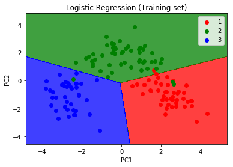
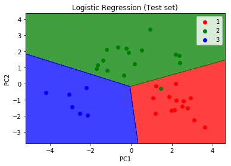

# Principal-Component-Analysis
The main idea of principal component analysis (PCA) is to reduce the dimensionality of a data set consisting of many variables correlated with each other, either heavily or lightly, while retaining the variation present in the dataset, up to the maximum extent.

<h1>Trainig data vis</h1>

<h1>test data vis</h1>

